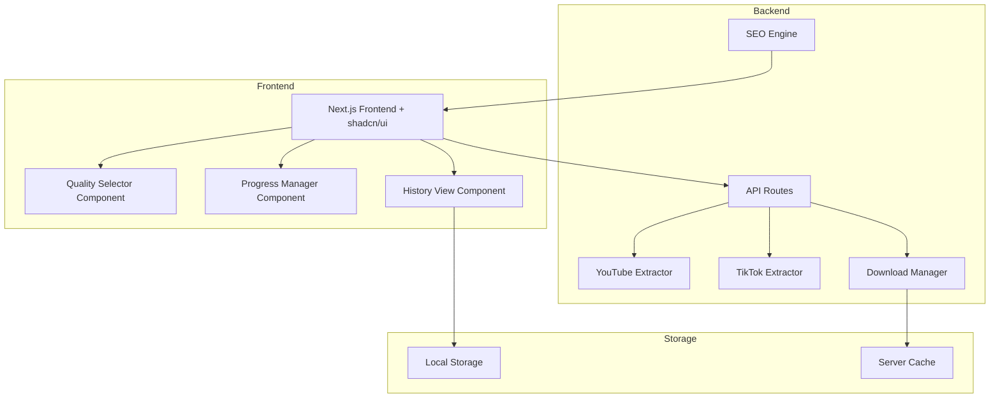

# Design Document: Advanced Media Downloader with SEO Support

## Overview

ระบบ Advanced Media Downloader with SEO Support เป็นเว็บแอปพลิเคชันที่พัฒนาด้วย Next.js สำหรับดาวน์โหลดสื่อจาก YouTube และ TikTok รองรับทั้ง MP3 และ MP4 พร้อมเลือกความละเอียด และมีระบบ SEO ขั้นสูงเพื่อให้เว็บไซต์ติดอันดับการค้นหา

## Tech Stack

- **Framework**: Next.js 14 (App Router)
- **UI Library**: shadcn/ui + Tailwind CSS
- **State Management**: React hooks + Context
- **Testing**: Vitest + fast-check
- **Icons**: Lucide React
- **Styling**: Tailwind CSS

## Architecture



## Components and Interfaces

### UI Components (shadcn/ui)

ใช้ shadcn/ui components สำหรับ UI:
- **Card**: แสดงข้อมูลวิดีโอและ download options
- **Button**: ปุ่ม download, format selection
- **Input**: URL input field
- **Select**: Quality selector dropdown
- **Progress**: Download progress bar
- **Tabs**: สลับระหว่าง YouTube/TikTok
- **Table**: Download history list
- **Alert**: Error messages และ notifications
- **Badge**: แสดง format tags (MP3/MP4)
- **Skeleton**: Loading states

### 1. URL Parser Service

```typescript
interface URLParserService {
  parseURL(url: string): ParsedURL | null;
  validateYouTubeURL(url: string): boolean;
  validateTikTokURL(url: string): boolean;
  extractVideoId(url: string): string | null;
}

interface ParsedURL {
  platform: 'youtube' | 'tiktok';
  videoId: string;
  originalUrl: string;
}
```

### 2. Video Extractor Service

```typescript
interface VideoExtractorService {
  extractVideoInfo(parsedUrl: ParsedURL): Promise<VideoInfo>;
  getAvailableQualities(videoInfo: VideoInfo): QualityOption[];
}

interface VideoInfo {
  id: string;
  title: string;
  description: string;
  thumbnail: string;
  duration: number;
  platform: 'youtube' | 'tiktok';
  qualities: QualityOption[];
}

interface QualityOption {
  quality: '360p' | '480p' | '720p' | '1080p' | '4k';
  format: 'mp4' | 'mp3';
  fileSize: number;
  bitrate?: number;
  available: boolean;
  recommended: boolean;
}
```

### 3. Download Manager Service

```typescript
interface DownloadManagerService {
  startDownload(videoInfo: VideoInfo, quality: QualityOption): DownloadTask;
  pauseDownload(taskId: string): void;
  resumeDownload(taskId: string): void;
  cancelDownload(taskId: string): void;
  getProgress(taskId: string): DownloadProgress;
}

interface DownloadTask {
  id: string;
  videoInfo: VideoInfo;
  quality: QualityOption;
  status: 'pending' | 'downloading' | 'paused' | 'completed' | 'failed';
  progress: DownloadProgress;
}

interface DownloadProgress {
  percentage: number;
  downloadedBytes: number;
  totalBytes: number;
  speed: number;
  estimatedTimeRemaining: number;
}
```

### 4. History Manager Service

```typescript
interface HistoryManagerService {
  saveDownload(record: DownloadRecord): void;
  getHistory(): DownloadRecord[];
  clearHistory(): void;
  deleteRecord(id: string): void;
}

interface DownloadRecord {
  id: string;
  title: string;
  url: string;
  platform: 'youtube' | 'tiktok';
  format: 'mp4' | 'mp3';
  quality: string;
  downloadedAt: string;
  fileSize: number;
}
```

### 5. SEO Engine Service

```typescript
interface SEOEngineService {
  generateMetaTags(page: PageInfo): MetaTags;
  generateStructuredData(page: PageInfo): JsonLd;
  generateSitemap(): string;
  generateCanonicalUrl(path: string): string;
}

interface MetaTags {
  title: string;
  description: string;
  keywords: string[];
  ogTitle: string;
  ogDescription: string;
  ogImage: string;
  twitterCard: string;
  twitterTitle: string;
  twitterDescription: string;
  canonical: string;
}

interface JsonLd {
  '@context': string;
  '@type': string;
  name: string;
  description: string;
  url: string;
  [key: string]: unknown;
}
```

## Data Models

### VideoInfo Schema

```typescript
const VideoInfoSchema = {
  id: string,
  title: string,
  description: string,
  thumbnail: string,
  duration: number,
  platform: 'youtube' | 'tiktok',
  qualities: QualityOption[]
}
```

### DownloadRecord Schema

```typescript
const DownloadRecordSchema = {
  id: string,
  title: string,
  url: string,
  platform: 'youtube' | 'tiktok',
  format: 'mp4' | 'mp3',
  quality: string,
  downloadedAt: string, // ISO 8601 format
  fileSize: number
}
```

## Correctness Properties

*A property is a characteristic or behavior that should hold true across all valid executions of a system-essentially, a formal statement about what the system should do. Properties serve as the bridge between human-readable specifications and machine-verifiable correctness guarantees.*

### Property 1: YouTube URL Validation
*For any* string input, the URL parser SHALL correctly identify valid YouTube URLs and reject invalid ones, returning appropriate parsed data or null.
**Validates: Requirements 1.1, 1.4**

### Property 2: TikTok URL Validation
*For any* string input, the URL parser SHALL correctly identify valid TikTok URLs and reject invalid ones, returning appropriate parsed data or null.
**Validates: Requirements 4.1, 4.4**

### Property 3: Quality Options Availability
*For any* extracted video info, the Quality Selector SHALL display only qualities that are marked as available, with unavailable options disabled.
**Validates: Requirements 3.1, 3.2**

### Property 4: File Size Estimation
*For any* selected quality option, the estimated file size SHALL be calculated based on bitrate and duration, and displayed to the user.
**Validates: Requirements 3.3**

### Property 5: Audio Extraction Quality
*For any* MP3 extraction, the resulting audio file SHALL have a bitrate of at least 128kbps.
**Validates: Requirements 2.3**

### Property 6: Download Progress Tracking
*For any* active download, the progress percentage SHALL be between 0 and 100, and the estimated time remaining SHALL update based on current download speed.
**Validates: Requirements 7.1, 7.2, 7.3**

### Property 7: Download History Round-Trip
*For any* valid DownloadRecord, serializing to JSON and then parsing back SHALL produce an equivalent record.
**Validates: Requirements 8.4, 8.5**

### Property 8: History Record Completeness
*For any* completed download, the saved history record SHALL contain title, date, format, and all required fields.
**Validates: Requirements 8.1, 8.2**

### Property 9: Meta Tags Completeness
*For any* page, the SEO Engine SHALL generate meta tags containing title, description, Open Graph tags, Twitter Card tags, and canonical URL.
**Validates: Requirements 5.1, 5.4, 5.5**

### Property 10: Sitemap Validity
*For any* generated sitemap, the XML SHALL be valid and contain URLs for all public pages.
**Validates: Requirements 5.2**

### Property 11: Structured Data Validity
*For any* page, the generated JSON-LD SHALL be valid JSON and contain required schema.org properties.
**Validates: Requirements 5.3**

### Property 12: Cache Headers Presence
*For any* static asset response, the HTTP headers SHALL include appropriate Cache-Control directives.
**Validates: Requirements 6.3**

### Property 13: Lazy Loading Implementation
*For any* image element on the page, the element SHALL have lazy loading attributes for non-critical images.
**Validates: Requirements 6.4**

## Error Handling

### URL Validation Errors
- Invalid URL format: Display "กรุณาใส่ URL ที่ถูกต้อง"
- Unsupported platform: Display "รองรับเฉพาะ YouTube และ TikTok เท่านั้น"
- Video not found: Display "ไม่พบวิดีโอ กรุณาตรวจสอบ URL อีกครั้ง"

### Download Errors
- Network error: Allow retry with resume capability
- Server error: Display error message with retry option
- File too large: Warn user before download

### Extraction Errors
- Private video: Display "วิดีโอนี้เป็นส่วนตัว ไม่สามารถดาวน์โหลดได้"
- Age-restricted: Display "วิดีโอนี้จำกัดอายุ"
- Region-blocked: Display "วิดีโอนี้ไม่พร้อมใช้งานในภูมิภาคของคุณ"

## Testing Strategy

### Unit Testing
- Use Vitest for unit testing
- Test URL parsing functions with various URL formats
- Test file size estimation calculations
- Test progress calculation functions
- Test SEO meta tag generation

### Property-Based Testing
- Use fast-check library for property-based testing
- Configure minimum 100 iterations per property test
- Each property test MUST be tagged with format: '**Feature: media-downloader-seo, Property {number}: {property_text}**'

### Test Coverage Requirements
- URL validation: Test valid/invalid YouTube and TikTok URLs
- Quality selection: Test all quality options and edge cases
- Download progress: Test progress calculations and ETA updates
- History management: Test serialization round-trip
- SEO generation: Test meta tags, sitemap, and structured data
